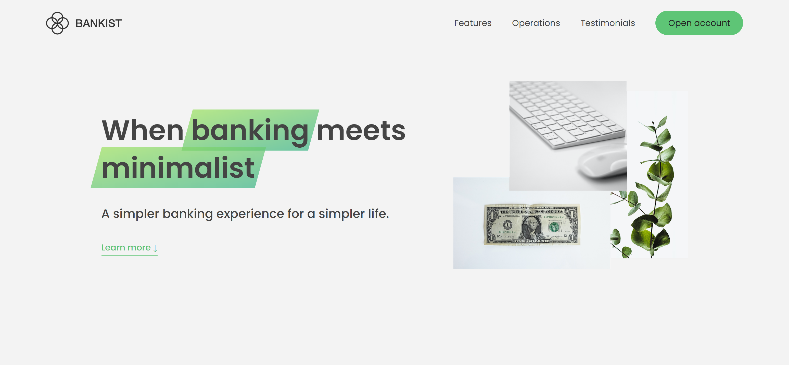

# Bankinst landing page
Bankist landing page I just made after learning some advance JavaScript DOM manipulations from Jonas Schmedtmann's course.

- [👉Live Preview👈](https://bankist-landing-page-codepapa360.netlify.app/)

### Built with

- Semantic HTML5 markup
- CSS custom properties
- Javascript
- Used advance DOM manipulations

## My Social Media

- LinkedIn - [@CodePapa360](https://www.linkedin.com/in/codepapa360)
- Twitter - [@CodePapa360](https://www.twitter.com/CodePapa360)
- Frontend Mentor - [@CodePapa360](https://www.frontendmentor.io/profile/CodePapa360)

#### Screenshot

